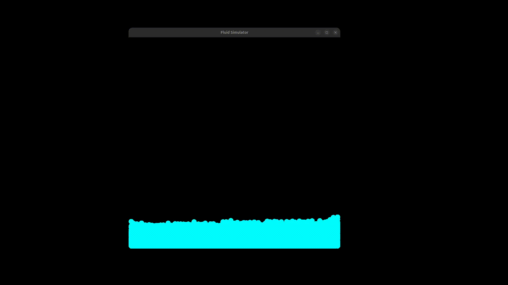

# 🌊 Viscoelastic Fluid Simulator

Um simulador de fluidos 2D baseado em partículas, implementado em **C++** utilizando a biblioteca **SFML**.

Este projeto explora técnicas de SPH (Smoothed Particle Hydrodynamics) para simular comportamentos de fluidos, focando em propriedades viscoelásticas (como elasticidade e plasticidade) e otimização de performance através de *Spatial Hashing*.

---

## 📸 Demonstração

### Simulação Livre


### Interação com Obstáculos


---

## 🎮 Controles

A simulação é interativa. Você pode criar partículas e exercer forças sobre elas em tempo real.

| Tecla / Ação | Função |
| :--- | :--- |
| **G** | Gera partículas na posição atual do mouse |
| **Clique Esquerdo** | Aplica força de atração (puxa o fluido) |
| **Clique Direito** | Aplica força de repulsão (empurra o fluido) |
| **Seta Cima** | Aumenta a quantidade de fluido gerado por clique |
| **Seta Baixo** | Diminui a quantidade de fluido gerado por clique |
| **W** | Aumenta a força de interação do mouse |
| **S** | Diminui a força de interação do mouse |

---

## ⚙️ Detalhes Técnicos

O motor físico (`Engine`) foi construído do zero e implementa os seguintes conceitos:

* **Double Density Relaxation**: Resolve a incompressibilidade do fluido e a pressão utilizando duas densidades alvo, permitindo um comportamento mais estável e visualmente agradável para líquidos.
* **Viscoelasticidade**: Implementação de molas virtuais entre partículas vizinhas que se formam e se rompem dinamicamente (plasticidade), permitindo simular materiais que variam entre líquido e gelatinoso.
* **Spatial Hashing**: Otimização de detecção de vizinhança `O(n)` utilizando um mapa de hash espacial (`std::unordered_map` com chaves de célula), essencial para manter a performance com milhares de partículas.
* **Integração**: Método de integração semi-implícito para atualização de posições e velocidades.

---

## 📚 Referências Teóricas

A física deste projeto baseia-se fortemente em pesquisas fundamentais da área de simulação de fluidos para computação gráfica:

1.  **Clavet et al. (2005)** - *Particle-based Viscoelastic Fluid Simulation*.
    * Principal referência para o algoritmo de relaxamento de densidade e o modelo de molas para viscoelasticidade e plasticidade implementado em `Engine::doubleDensityRelaxation` e `Engine::adjustSpring`.
2.  **Müller et al. (2003)** - *Particle-Based Fluid Simulation for Interactive Applications*.
    * Base para os conceitos fundamentais de SPH (Smoothed Particle Hydrodynamics) e forças de interação baseadas em kernels de suavização.

---

## 🚀 Como Compilar e Rodar

### Pré-requisitos
* Compilador C++ (g++, clang)
* [SFML 2.5+](https://www.sfml-dev.org/)

### Compilando (Exemplo via terminal Linux)

```bash
# Certifique-se de ter a SFML instalada
# Exemplo no Ubuntu: sudo apt-get install libsfml-dev

g++ -c main.cpp commands.cpp engine.cpp particle.cpp entities/body/Wall/Wall.cpp entities/body/Circle/Circle.cpp entities/body/Rect/Rect.cpp -I.
g++ main.o commands.o engine.o particle.o Wall.o Circle.o Rect.o -o fluid_sim -lsfml-graphics -lsfml-window -lsfml-system

# Executar
./fluid_sim